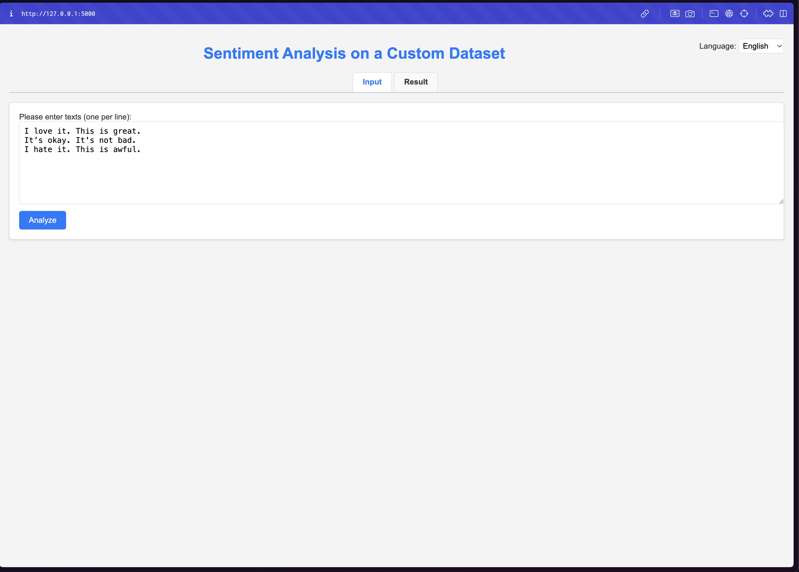
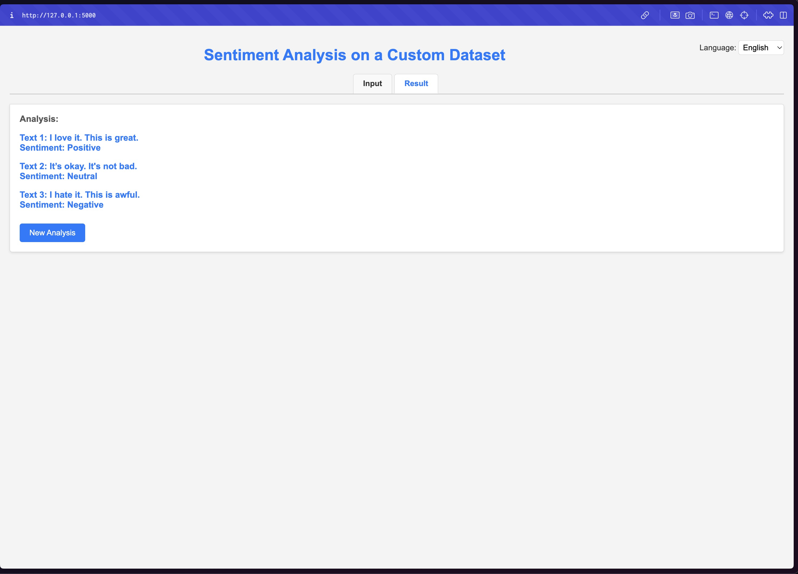

# Sentiment Analysis on a Custom Dataset

## Table of Contents

1. [Overview](#overview)
2. [Features](#features)
3. [Technologies Used](#technologies-used)
4. [Prerequisites](#prerequisites)
5. [How to Run](#how-to-run)
6. [How to Use](#how-to-use)
7. [Technical Tools and Why They Were Used](#technical-tools-and-why-they-were-used)
    - [Pre-Trained Model](#pre-trained-model)
    - [Tools](#tools)
8. [Customization](#customization)
9. [Sample Text](#sample-text)
10. [Screenshots](#screenshots)


## Overview

This project is a web-based application for performing **sentiment analysis** on a custom dataset. Users can input text, analyze sentiment, and view results interactively in multiple languages.

## Features

- **Multi-language Support**: Interface supports English, Spanish, Italian, French, and German.
- **Dynamic Tab Navigation**: Separate tabs for input and result views.
- **Responsive UI**: Mobile-friendly with an intuitive design.
- **Timeout Handling**: Requests timeout after 10 seconds to prevent long wait times.

## Technologies Used

- **Frontend**: HTML, CSS, JavaScript
- **Backend**: Python (with Flask, Transformers, and PyTorch)
- **Styling**: Custom CSS for a polished UI
- **API Endpoint**: `/analyze` for handling sentiment analysis
- **Pre-Trained Model**: `nlptown/bert-base-multilingual-uncased-sentiment`
  - Designed for sentiment analysis across multiple languages.
  - Outputs star ratings (1-5 stars), mapped to user-friendly sentiment labels.

## Prerequisites

Here’s the updated prerequisites section with Git installation instructions that avoid using Homebrew:

### Prerequisites

1. **Python 3.12 or Above**  
   This project is built and tested with Python 3.12. Using this version or newer is recommended for compatibility and optimal performance.  

2. **Programming Editor (e.g., Visual Studio Code)**  
   A text editor like Visual Studio Code (VS Code) is required for writing and running the code.  
   - Install VS Code from the [official website](https://code.visualstudio.com/).  

3. **Anaconda**  
   Anaconda simplifies package and dependency management. It includes:  
   - All required libraries (`Flask`, `Transformers`, `torch`) pre-installed in the base (root) environment.  
   - Integrated tools like Jupyter Notebook and Spyder for development.  

   Install Anaconda as follows:  
   - **macOS**: Download the `.pkg` file from [Anaconda's official site](https://www.anaconda.com/) and follow the installer instructions.  
   - **Windows**: Download the `.exe` file and follow the installer instructions.  
   - **Linux**: Download the `.sh` file and run:  
     ```bash
     bash filename.sh
     ```  

4. **Git**  
   Git is required for version control and project collaboration.  

   - **macOS**: Install Git via the Xcode Command Line Tools:  
     1. Open Terminal and run:  
        ```bash
        xcode-select --install
        ```  
     2. Follow the on-screen instructions to complete the installation.  

   - **Windows**: Download the Git installer from [Git's official website](https://git-scm.com/) and follow the instructions.  

   - **Linux**: Install Git via your package manager:  
     - For Ubuntu/Debian:  
       ```bash
       sudo apt update
       sudo apt install git
       ```  
     - For Fedora:  
       ```bash
       sudo dnf install git
       ```  

   Verify the installation by checking the version:  
   ```bash
   git --version
   ```
## How to Run

1. **Clone the repository**:
   ```bash
   git clone <repository-url>
   cd <repository-folder>
   ```

2. **Create a Virtual Environment**:
   To isolate the project dependencies, create a virtual environment in the project folder.

   - **Using Python's `venv`**:
     - **macOS/Linux**:
       ```bash
       python -m venv env
       source env/bin/activate
       ```
     - **Windows**:
       ```bash
       python -m venv env
       env\Scripts\activate
       ```

   - **Alternative (Using VS Code)**:
     1. Open the project folder in **VS Code**.
     2. Open the **Command Palette** (press `Ctrl+Shift+P` or `Cmd+Shift+P`).
     3. Type and select `Python: Create Environment`.
     4. Choose `venv` as the environment type and follow the prompts.
     5. VS Code will automatically activate the environment.

3. **Open in VS Code**:
   - Launch **VS Code** and open the project folder.
   - Select the Python interpreter installed with Anaconda's base (root) environment.
If the Python interpreter base(root) is not visible in VS Code: Navigate to the Environments section in Anaconda Navigator and select base(root). At the bottom of the screen, you will see a message displaying the interpreter path as "Loading packages... [interpreter path]." You can use this path to manually select the Python interpreter in VS Code.

4. **Run the Application**:
   - In VS Code's terminal or command palette, run:
     ```bash
     python app.py
     ```

5. **Access the Application**:
   - Open a web browser and navigate to link given in the terminal.
  
## How to Use

1. Select your preferred language using the dropdown in the top-right corner.
2. Enter your text (one per line) in the provided input field.
3. Click "Analyze" to process the sentiment of the input text.
4. View the results on the "Result" tab.
5. To start a new analysis, click "New Analysis" and clear the input field.

See the screenshots if you are lost.

## Technical Tools and Why They Were Used

### Pre-Trained Model
- **Model**: `nlptown/bert-base-multilingual-uncased-sentiment`
  - Supports multilingual sentiment analysis, which aligns with the application's multilingual features.
  - Outputs sentiment as star ratings (1-5 stars), which are mapped to user-friendly categories ("Negative," "Neutral," "Positive").
  - Pre-trained on a large dataset, saving time and computational resources for training.

### Tools
1. **Flask**:
   - Lightweight web framework for creating the backend API.
   - Simplifies serving the user interface and processing API requests.

2. **Transformers Library**:
   - Provides access to pre-trained models like `nlptown/bert-base-multilingual-uncased-sentiment`.
   - Makes it easy to load and infer with state-of-the-art NLP models.

3. **PyTorch**:
   - Backend framework used for running the pre-trained model.
   - Supports GPU acceleration, enabling faster inference.

4. **GPU Detection**:
   - Detects GPU availability and runs the model on GPU if available, improving performance.

5. **Sentiment Label Mapping**:
   - Converts raw star ratings into intuitive labels ("Negative," "Neutral," "Positive").
   - Enhances the user experience by providing clear and meaningful results.


## Customization

To add or modify supported languages, update the `translations` object in the `<script>` section of `app.html`.


## Sample Text

### English
- I love it. This is great.
- It’s okay. It's not bad.
- I hate it. This is awful.

### French
- J'adore. C'est génial.
- C'est pas mal. Ce n'est pas mal.
- Je déteste. C'est horrible.

## Screenshots

Here are some screenshots of the application:

- **Input Tab:**  
 

- **Result Tab:**  
 
